# AWS EKS GitOps Platform — ArgoCD, ApplicationSets & Kustomize

This repository implements a **production-grade GitOps layer** for managing **platform services and application workloads on AWS EKS**, following current industry best practices used in **mid–large scale production environments**.

The repository intentionally focuses **only on the Kubernetes and GitOps layers**.

The underlying **AWS infrastructure and EKS cluster** are provisioned via Terraform and maintained in a **separate, dedicated IaC repository**:

**Terraform Infrastructure (authoritative source):**
[https://github.com/LaurisNeimanis/aws-eks-platform](https://github.com/LaurisNeimanis/aws-eks-platform)

This strict separation reflects how modern organizations split **infrastructure provisioning** and **cluster/application lifecycle management** across teams and repositories.

> **Note on Cloud Scope**
>
> While the Kubernetes and GitOps patterns are cloud-agnostic,
> this repository includes AWS-specific service annotations and Cloudflare DNS integration
> as concrete platform examples.
>
> The same architectural approach can be applied to other Kubernetes environments
> (GKE, AKS, on-prem), with infrastructure-specific components treated as external
> dependencies.

---

## Architectural Principles

The architecture prioritizes:

- Clear separation of responsibilities between infrastructure provisioning and cluster lifecycle management
- GitOps as the single source of truth for Kubernetes state
- Explicit ownership boundaries between platform and application workloads
- Scalable application management using ApplicationSets
- Operational predictability over convenience-driven shortcuts

The goal is a maintainable, extensible GitOps setup that remains understandable as teams, environments, and workloads grow.

---

## Scope & Responsibilities

This repository manages **everything above the infrastructure layer**.

### In scope

* Kubernetes workloads (applications)
* Platform services (Traefik, ExternalDNS, ingress policy)
* Environment-specific configuration
* GitOps reconciliation logic
* Cluster bootstrap entrypoint (App-of-Apps pattern)

### Out of scope

* AWS infrastructure provisioning (VPC, EKS, IAM, networking)
* Terraform state and lifecycle
* Low-level cluster creation

Infrastructure is treated as a **stable external dependency**, provisioned separately and consumed by this GitOps layer.

---

## Repository Structure

```text
aws-eks-gitops/
├── apps/
│   ├── platform/                  # Cluster-wide components (Helm values only)
│   │   ├── traefik/
│   │   │   └── values/
│   │   └── external-dns/
│   │       └── values/
│   │
│   └── workloads/                 # Application workloads (Kustomize)
│       ├── whoami/
│       └── ccore-ai/
│
├── argo/                          # Argo CD control layer
│   ├── root-application.yaml
│   ├── projects/
│   └── applicationsets/
│
├── docs/
│   ├── installation.md              # End-to-end bootstrap & access
│   └── gitops-runtime-architecture.md
│
├── LICENSE
└── README.md
```

---

## Architecture Overview

```mermaid
flowchart TD
    TF[Terraform Infrastructure<br/>AWS VPC · EKS · IAM · Networking]
    ARGO[ArgoCD<br/>GitOps Control Plane]
    APPSET[ApplicationSets]
    PLATFORM[Platform Services<br/>Traefik · ExternalDNS]
    WORKLOADS[Application Workloads]
    INGRESS[AWS NLB]
    DNS[Cloudflare DNS]

    TF --> ARGO
    ARGO --> APPSET
    APPSET --> PLATFORM
    APPSET --> WORKLOADS
    PLATFORM --> INGRESS
    INGRESS --> DNS
```



High-level flow:

```text
Terraform (AWS / EKS)  ← aws-eks-platform repo
        ↓
ArgoCD (out-of-band installed control plane)
        ↓
App-of-Apps (root-application.yaml)
        ↓
ApplicationSets
        ↓
Platform services & Workloads
```

### Layering Model

* **Terraform** – AWS infrastructure, EKS, IAM, networking, IRSA, load balancers
* **ArgoCD** – Kubernetes reconciliation engine
* **ApplicationSets** – scalable, environment-aware application definitions
* **Kustomize** – workload-level environment customization

This separation mirrors how production platforms are operated in practice.

> 📘 **Detailed runtime view**  
> For a low-level, implementation-oriented view of the control plane,
> reconciliation flow, and ingress runtime behavior, see:  
> [`docs/gitops-runtime-architecture.md`](docs/gitops-runtime-architecture.md)

---

## Installation & Bootstrap

This repository uses a **deterministic, App-of-Apps based bootstrap flow**.

The full installation and bootstrap procedure is documented here:

📄 **Installation & Bootstrap Guide**  
→ [`docs/installation.md`](docs/installation.md)

The guide covers:
- Argo CD bootstrap (out-of-band)
- Project creation and security boundaries
- Root Application (App-of-Apps) initialization
- Day-2 operational model

---

## GitOps Model

### ApplicationSets

* Used for both **platform services** and **workloads**
* Replaces static ArgoCD Application manifests
* Enables horizontal scaling across environments and applications

### Kustomize

* Used **only for workloads**
* `base/` defines reusable application structure
* `overlays/` capture environment-specific differences
* Platform components intentionally avoid Kustomize duplication

---

## Platform vs Workloads Responsibility Split

### Platform (cluster-owned)

* Traefik ingress controller
* ExternalDNS
* Global ingress behavior and policy

### Workloads (application-owned)

* Deployments
* Services
* IngressRoutes

This enforces:

* Centralized ingress policy
* No duplication of platform logic
* Predictable application behavior

---

## DNS & Ingress Model

The platform uses a **single shared ingress endpoint**:

```text
ingress.ccore.ai
```

### TLS Termination & Redirect

TLS is terminated at the AWS Network Load Balancer using ACM.
Traefik operates behind the load balancer and does not manage certificates.

HTTP to HTTPS redirection is enforced globally at the Traefik entryPoint level.

### DNS Flow

* Traefik provisions an AWS NLB
* ExternalDNS automatically manages DNS records in **Cloudflare**
* Application domains are defined as CNAMEs:

```text
demo.ccore.ai    → ingress.ccore.ai
whoami.ccore.ai  → ingress.ccore.ai
```

ExternalDNS continuously reconciles DNS state, ensuring:

* No manual DNS drift
* Automatic recovery from load balancer changes

Applications define routing exclusively via **Traefik IngressRoute resources**.

---

## Example Workloads

### whoami

* Minimal HTTP echo service
* Used for ingress, TLS, and routing validation
* Demonstrates ingress routing and global HTTP → HTTPS enforcement

### ccore-ai

Demo application consisting of:

* Backend API
* Streamlit frontend

Characteristics:

* Frontend → Backend communication via Kubernetes Service DNS
* Backend endpoint configurable via environment variables
* HTTPS enforced at the platform ingress layer
* No per-application DNS automation

---

## CI / Automation Roadmap

Planned extensions:

* GitHub Actions for:

  * YAML schema validation
  * Kustomize build verification
  * Policy and convention checks
* Optional image update automation
* GitOps-safe promotion workflows

CI remains **advisory**. ArgoCD is the **single reconciliation authority**.

---

## Security Model

* Secrets are **never stored in Git**
* Sensitive values are injected via Kubernetes Secrets

Example:

```text
Name: cloudflare-api-token
Namespace: external-dns
```

GitOps manages references only, never secret material.

---

## Design Summary

This repository implements a layered GitOps architecture for AWS EKS, focused on separation of concerns, operational safety, and scalability.

The result is a maintainable platform suitable for real-world Kubernetes operations.

Although implemented on AWS EKS, the design principles and GitOps patterns demonstrated here intentionally avoid cloud-specific coupling.
