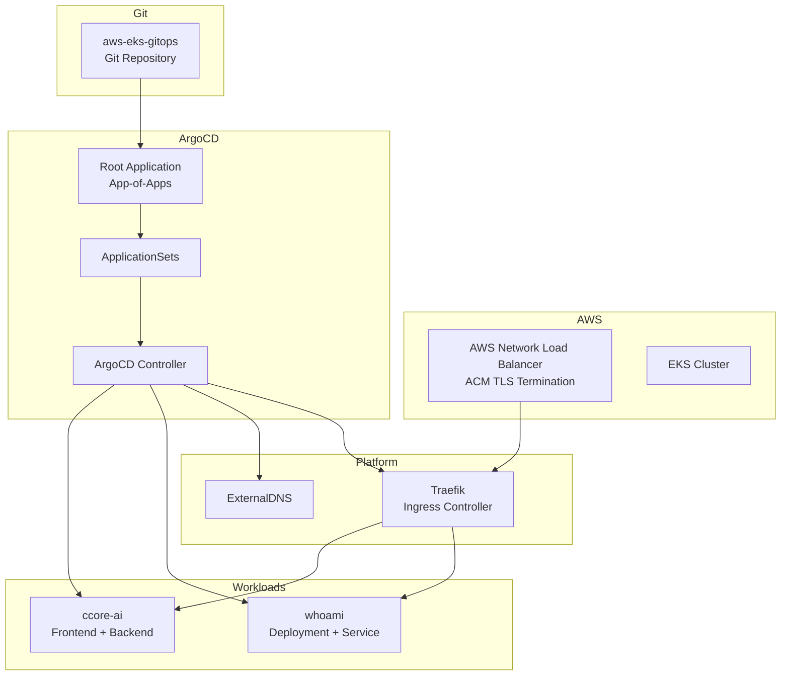
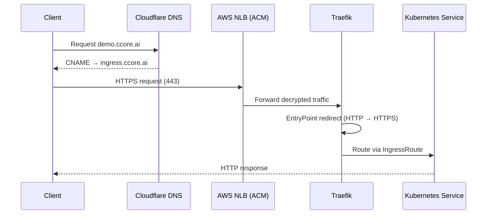

# Low-Level Architecture — AWS EKS GitOps Platform

This document provides a **low-level, implementation-oriented view** of the GitOps platform,
complementing the high-level architecture described in the main README.

The focus here is on **control flow, reconciliation boundaries, and runtime responsibilities**
across Terraform, ArgoCD, ApplicationSets, and Kubernetes workloads.

---

## Control Plane & Reconciliation Flow

---

## Ingress & Traffic Flow

---

## GitOps Responsibility Boundaries

### Terraform (out of scope for this repo)
- VPC, subnets, routing
- EKS cluster provisioning
- IAM, IRSA, load balancer integration
- ACM certificate provisioning

### ArgoCD
- Continuous reconciliation engine
- Drift detection and self-healing
- ApplicationSet expansion
- Namespace lifecycle (CreateNamespace)

### ApplicationSets
- Environment-aware application instantiation
- Horizontal scalability across apps and environments
- Single source of truth for application definitions

### Platform Layer
- Traefik ingress controller
- Global HTTP → HTTPS enforcement at entryPoint level
- ExternalDNS integration with Cloudflare
- Shared ingress endpoint (`ingress.ccore.ai`)

### Workload Layer
- Deployments and Services
- IngressRoute definitions only
- No platform logic duplication
- No infrastructure awareness

---

## Design Characteristics

- No circular dependencies
- Clear ownership boundaries
- Global ingress behavior enforced once
- Application definitions remain minimal and explicit
- GitOps reconciliation is the only mutation path

This low-level view reflects the **actual runtime behavior** of the platform,
not just conceptual intent.
